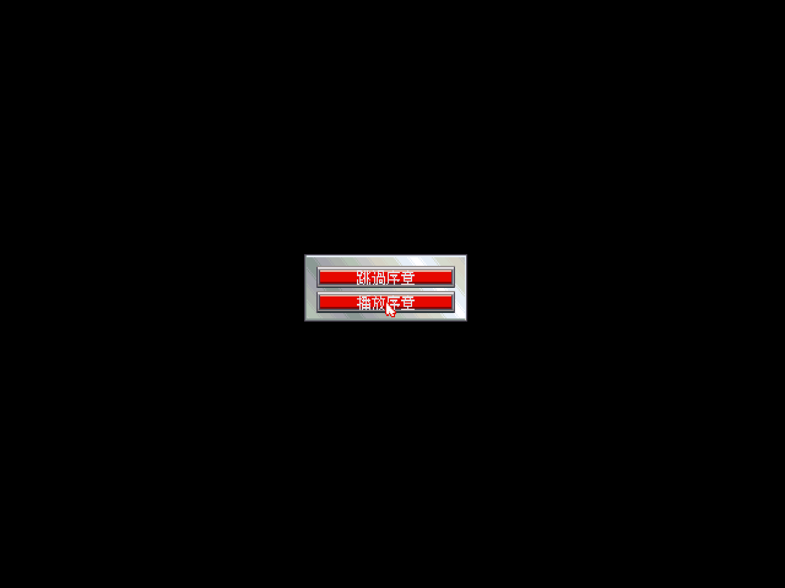

# Rise of the Dragon 繁體中文化

> 把 1990 年的賽博龐克偵探冒險《Rise of the Dragon》（Dynamix）做成可玩的**繁體中文版** —
> 透過自製 patch 的 ScummVM、真實點陣中文字、與一份逐句重譯的中文劇本。
>
> 🚧 **這個專案還在路上。** 遊戲已能在 ScummVM 跑起來、整本英文劇本（2,386 句）抽出來了，
> **中文也已經能在遊戲畫面裡渲染出來**（見下圖）；接下來是全量翻譯與排版。詳細進度見 [`PLAN.md`](PLAN.md)。

| 原版（英文） | 中文化（本專案） |
|---|---|
|  |  |
| `SKIP / PLAY INTRODUCTION` | `跳過序章 / 播放序章` |

> 上圖是開機第一個畫面。中文用自製 24×24 點陣字渲染，按 **F8** 可即時切換英文 / 中文。

連選單也整套中文化了（遊玩 / 控制設定 / 選項 / 校準 / 檔案 / 離開遊戲）：

---

## 一封寫給三十年前那個小孩的信

還記得嗎？1990 年代初的某個深夜，14 吋 CRT 的光打在臉上，320×200 的 VGA 畫面裡，
一個落魄的前警探站在 2053 年雨夜的洛杉磯街頭。霓虹、毒品、邪教、還有一個叫「龍」的東西。

**我小時候就是在那台電腦前面，玩這款 AVG —— 英文一個字都看不懂。** 那時候沒有翻譯、沒有
GameFAQ、沒有 Discord、沒有 wiki，卡關了只能翻《電腦玩家》《軟體世界》《PC Game》那幾本厚厚的攻略，
或者打去同學家問。《Rise of the Dragon》英文又冷硬、劇情又黑，我們這代很多人其實是**「看著畫面腦補劇情」**打完的 ——
猜那個男主角在說什麼、猜他女友出了什麼事、猜那條「龍」到底是誰。

三十年後，我把當年看不懂的每一句台詞，一句一句翻成你看得懂的繁體中文。而且 ——
那個男主角，我們不叫他 Blade，我們叫他**孟波**（為什麼？往下看〈譯名考古〉）。

這個專案，就是寫給三十年前那個看不懂英文、卻還是玩到結局的小孩。

---

## 關於《Rise of the Dragon》

**Dynamix 開發、Sierra On-Line 發行，1990 年，Jeff Tunnell 設計。** 全名是
*Rise of the Dragon: A Blade Hunter Mystery*。在那個還在畫城堡與太空船的冒險遊戲市場裡，
它選了一條很大膽的路：**直接致敬《銀翼殺手》(Blade Runner) 的賽博龐克黑色電影**。

- **時間是 2053 年，地點是衰敗的洛杉磯。** 你是 William「Blade」Hunter，
  一個丟了警徽、靠接私案過活的偵探。市長的女兒被一種不明物質啃蝕致死，背後牽連到一款叫
  **MTZ** 的新型毒品；你被請去查源頭，然後一頭撞進毒梟、幫派與「新黎明教團」的陰謀裡。
- **它的畫面在當年是狠角色。** 不是手繪卡通，而是**真人演員的數位化照片**合成漫畫分鏡、
  搭配手繪背景 —— 第一人稱視角，像在演一部互動電影。
- **遊戲跑著一個即時時鐘。** 世界不等你。約會遲到、線索過期、該睡的時候不睡，
  劇情就真的會走向不同的（通常很慘的）結局。女友 **Karyn**、線人 **Jake**、
  唐人街的 **Chen** 與 **Qwong**…每個人都有自己的時間表。
- **它會讓你死，而且死法很多。** 這是當年少數敢碰成人題材、敢讓主角當場領便當的遊戲之一。

《電腦遊戲世界》(Computer Gaming World) 在 1996 年把它選進「史上百大遊戲」第 83 名；
2000 年的回顧則稱它是「**被低估的經典，遠遠超前它的時代**」。對 1990 年代的台灣小孩來說，
它則是一款「畫面很猛、英文很硬」的遊戲。我們想做的，就是把那層語言的牆拆掉。

> 資料來源：[Wikipedia](https://en.wikipedia.org/wiki/Rise_of_the_Dragon)、[MobyGames](https://www.mobygames.com/game/98/rise-of-the-dragon/)、[Dynamix Wiki](https://dynamix.fandom.com/wiki/Rise_of_the_Dragon)。

---

## 譯名考古：為什麼男主角叫「孟波」？

主角本名 William **"Blade"** Hunter。照字面，"Blade" 是刀刃、"Hunter" 是獵人。
照規矩，我們大可音譯成「布雷德」「布萊德」之類 —— 但那樣就少了一個只有我們這代台灣玩家才懂的梗。

倒帶回 1980 年代末、1990 年代初的台灣。那時候北条司的漫畫《城市獵人》(City Hunter) 風靡一時，
而盜版年代的譯本，把男主角 **冴羽獠**（Saeba Ryo）翻成了一個家喻戶曉的名字 ——**孟波**。
（對岸那邊翻「寒羽良」，但在台灣，他就是孟波。）這個譯名生命力強到，2019 年法國真人版引進台灣時，
片商辦投票問大家要叫哪個名字，**有 62% 的人還是選了「孟波」**。

於是我們做了一個決定：既然 Blade 也是個吊兒郎當、神槍在身、心裡藏著柔軟的都市獵人，
就讓他**接上那條台灣集體記憶的線**——

- **Blade（William "Blade" Hunter）→ 孟波**　 *City Hunter →「都市獵人」→ 孟波，雙關全中。*
- **Karyn（女友）→ 阿香**　 *對應《城市獵人》的女主角槙村香，與孟波成對。*

這不是「正確」的翻譯，是**鄉愁的翻譯**。我們在還原的，不只是 1990 年的洛杉磯，
還有 1990 年那個趴在電腦前、把《城市獵人》和《Rise of the Dragon》在腦子裡接在一起的小孩。

> 資料來源：[冴羽獠 - 維基百科](https://zh.wikipedia.org/zh-hk/%E5%86%B4%E7%BE%BD%E7%8D%A0)、[Netflix 城市獵人真人版報導 (HK01)](https://www.hk01.com/遊戲動漫/1014758/)。完整譯名對照見 [`CONTEXT.md`](CONTEXT.md)。

---

## 這個專案做了什麼

ScummVM 已經能執行這款遊戲，所以我們**不碰遊戲本體的執行邏輯**，
而是在 ScummVM 這一層動手腳：

1. **把劇本挖出來** — 遊戲對話藏在壓縮過的場景檔（DGDS 格式）裡。
   我們照著 ScummVM 的引擎原始碼，寫了一套工具把封裝拆開、解壓、解析，
   抽出全部 **2,386 句對白**（英文原版）。
2. **重新翻成繁體中文** — 以英文原典為準（手上的德文版只當參照）。
3. **讓引擎看得懂中文** — 替 ScummVM 加上一套**真實 24×24 點陣中文字**，
   讓 320×200 的老畫面放大到 640×480 時，中文依然清楚。
4. **可以切換語言** — 計畫加上一個熱鍵，遊戲中即時切換 **中文 / 英文**（之後還會支援**日文**）。
   原始英文檔完全不動，中文是「疊」上去的，所以三種語言可以共存。

> 換句話說：你買的、你手上的那份原版遊戲檔不會被改壞；中文是一層可開可關的外掛。

---

## 怎麼玩（之後才會有的步驟）

> ⚠️ 下列流程在專案完成前還無法直接使用，先放在這裡當作藍圖。

1. 準備一份你**合法擁有**的《Rise of the Dragon》遊戲檔。
2. 下載本專案 release 裡的 patched ScummVM（Linux AppImage / Windows / macOS 三選一）。
3. 把中文語言包放到遊戲目錄旁。
4. 啟動，指向你的遊戲目錄即可遊玩；用語言鍵切換中／英。

---

## 目前進度

| 階段 | 內容 | 狀態 |
|---|---|---|
| Phase 0 | 格式逆向、劇本抽取、ScummVM 基線可跑 | ✅ 完成 |
| Phase 1 | 24×24 中文字型 + 引擎渲染（第一句中文上畫面） | ✅ 完成 |
| Phase 2 | 翻譯 overlay + 語言切換鍵（F8） | 🚧 機制完成 |
| Phase 3 | UI / 按鈕中文化 | ⬜ |
| Phase 4 | 全量翻譯與潤飾 | ⬜ |
| Phase 5 | 三平台打包 | ⬜ |

完整工程計畫見 [`PLAN.md`](PLAN.md)、引擎技術設計見 [`docs/DESIGN-cjk-engine.md`](docs/DESIGN-cjk-engine.md)、術語表見 [`CONTEXT.md`](CONTEXT.md)。

### 技術概念一句話

> 我們**不改遊戲檔**。中文是一份**離線編好的 Big5 點陣字 + 譯文包**，由 patched ScummVM 在「畫對話的那一刻」查表替換、即時切換語言 —— 所以英文 / 中文 /（日後）日文可以共存，按一個鍵就換。

---

## 版權聲明

《Rise of the Dragon》原始版權屬 **Dynamix / Sierra**（現屬其權利繼承者）。
**本專案不包含、也不重新發布任何遊戲原始檔。** 這裡所有的工具、patch、譯文、字型，
皆為衍生的中文化作品，僅供**已合法擁有原版遊戲**的玩家使用。
遊戲執行倚賴開源的 [ScummVM](https://www.scummvm.org/)。

## 致謝

- **ScummVM 團隊** — `dgds` 引擎讓這款老遊戲能在現代機器上重生，也是我們逆向格式的權威依據。
- **Dynamix / Jeff Tunnell** — 在 1990 年就把賽博龐克搬進冒險遊戲。
- 繁體點陣字採用開源字型（Noto Sans CJK TC、文泉驛、AR PL UMing）rasterize 而成。
