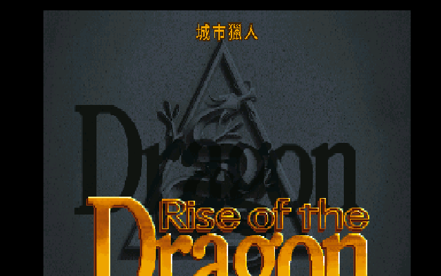
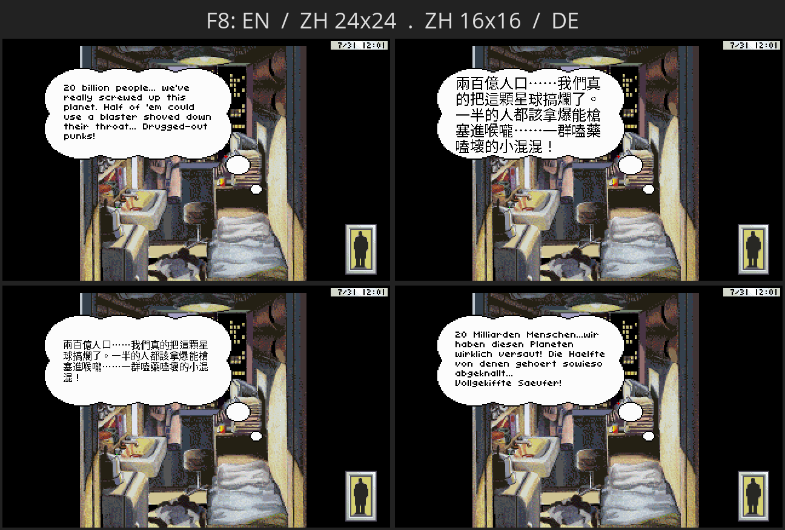
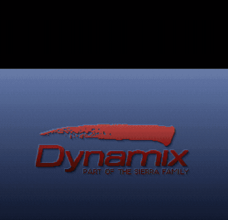

<!-- markdownlint-disable MD033 MD041 -->

# Rise of the Dragon 繁體中文化

> Dynamix 1990 年的賽博龐克偵探冒險，三十六年後的繁體中文版。
> 在 ScummVM 上遊玩，按一個鍵就能在中／英／德文之間切換 —— 不改你的任何一個遊戲檔。

<p align="center">
  
</p>

> 開場標題畫面上那行金字「**城市獵人**」，不是 P 圖、不是貼上去的 README 裝飾 —— 是**遊戲執行時引擎即時疊上去的**，描邊與漸層比對原版「Rise of the Dragon」金色 logo 的調色盤。我們連標題畫面，都替孟波補上了那行金字。（為什麼是「城市獵人」？見〈[譯名考古學](#names)〉。）

<p align="center">
  
</p>

> 開機選單 →「孟波」在公寓裡的內心獨白，全程繁體中文、真 **24×24 點陣字**。整本劇本 **2,386 句**翻完、UI 全中文。

---

## 給三十年後的那個小孩 —— 一封開場信

那是 1990 年代初。14 吋 CRT 的光映在一個孩子臉上，螢幕裡是 2053 年的洛杉磯 —— 終年下著酸雨的霓虹街道、賣合成毒品的暗巷、一個丟了警徽的偵探。遊戲叫《Rise of the Dragon》，全英文，劇情又黑又冷。而那個孩子，連主選單都讀不順。

他是怎麼破關的？用猜的。猜偵探在自言自語什麼、猜他女友出了什麼事、猜那條「龍」到底是人是物。卡住了就翻《電腦玩家》《軟體世界》《PC Game》—— 那個年代沒有 GameFAQ、沒有 wiki、沒有 Discord，攻略是用印刷油墨還沒乾的厚手冊換來的。他把每一格畫面看了又看，在腦子裡替角色配上一整套自己編的中文台詞。

那個孩子是我。三十年後，我把當年腦補的每一句，換成真正的譯文 —— 一句一句，全劇本 2,386 句。而且，那個偵探我們不叫他 Blade。我們叫他**孟波**。

這封信你可以三層讀：想直接玩 → 跳到 [快速開始](#quick-start)；想重溫劇情、角色與譯名考古 → 慢慢讀 [遊戲本體](#magazine)；想知道技術上怎麼把英文「換」成中文、怎麼疊出那行金字 → 翻到 [技術深潛](#tech)。

---

## 目錄

- [快速開始](#quick-start)
- [遊戲本體 —— 2053 年的洛杉磯](#magazine)
  - [這是一款什麼遊戲](#about)
  - [孟波與他身邊的人](#cast)
- [譯名考古學：為什麼男主角叫「孟波」？](#names)
- [實機展示：F8 一鍵換語言](#showcase)
- [行動版：Galaxy S25 上點一下就進遊戲](#android)
- [技術深潛 —— 英文怎麼變中文，金字怎麼疊上標題](#tech)
  - [封裝與資源：VOLUME.VGA](#volume)
  - [三條繪字路徑](#paths)
  - [TTM STORE-AREA 持久層](#ttm)
  - [城市獵人標題副標：偵測、描邊、調色盤比對](#title-overlay)
  - [引擎 overlay 與打包](#engine)
  - [行動版注入](#android-tech)
- [Sega CD 日文版逆向（籌備中）](#segacd)
- [致謝](#thanks)
- [版權聲明](#legal)

---

<a name="quick-start"></a>

## 🎮 快速開始

你需要一份**自己合法擁有**的《Rise of the Dragon》遊戲資料夾（內含 `VOLUME.VGA` 等）。本專案**不含、也不發布**任何遊戲原始檔。

中文化已打包成**五大平台**，全部 ship 完成（中文是「疊」在原始英文遊戲上的 overlay，可隨時切回英文／德文對照，存檔與遊戲檔完全不受影響）：

| 平台 | 產物 | 怎麼玩 |
|---|---|---|
| **Linux** | `Rise-of-the-Dragon-CHT-x86_64.AppImage`（單檔）/ `rotd-cht-linux-x86_64.tar.gz` | `./Rise-of-the-Dragon-CHT-x86_64.AppImage /你的/遊戲路徑`（不給路徑會自動偵測旁邊的遊戲）|
| **Windows** | `rotd-cht-windows-x86_64.zip` | 把遊戲資料夾放進解壓目錄，雙擊 `play-rotd-cht.bat` |
| **macOS** | `rotd-cht-macos.tar.gz`（CI 出的 `.app`）| `Contents/MacOS/scummvm --extrapath=Contents/Resources/extra --path=<遊戲> rise` |
| **Android** | CI base APK + 本機注入遊戲 → 自留的完整 APK | 直接安裝，點圖示**直接進遊戲**（d-pad + 滑鼠左右鍵 + F8 切語言）|

- 預設就是**中文 24×24**。遊戲中按 **F8** 即時循環：**英文 → 中文 24×24 → 中文 16×16 → 德文**（日文籌備中）。
- 引擎來源：Linux 本機、Windows（Docker mingw 交叉編譯）、macOS／Android 由 GitHub Actions CI（[`.github/workflows/build.yml`](.github/workflows/build.yml)）建置。**含遊戲的完整包僅供自己保存，請勿散布。**

打包腳本：[`package_linux.sh`](scripts/package_linux.sh)、[`package_appimage.sh`](scripts/package_appimage.sh)、[`build_windows.sh`](scripts/build_windows.sh)、[`build_macos.sh`](scripts/build_macos.sh)、[`tools/inject_android.sh`](tools/inject_android.sh)。

---

<a name="magazine"></a>

## 🕹️ 遊戲本體 —— 2053 年的洛杉磯

要懂這份中文化在翻什麼，得先回到孟波的世界。這不是有龍、有城堡、有公主的冒險遊戲 —— 它的舞台是一座終年下著酸雨、霓虹刺眼、毒品橫流的衰敗都市，1990 年的 Dynamix 直接把《銀翼殺手》(Blade Runner) 的黑色電影搬進了你的 14 吋螢幕。

<a name="about"></a>

### 這是一款什麼遊戲

**Dynamix 開發、Sierra On-Line 發行，1990 年，Jeff Tunnell 設計。** 全名是 *Rise of the Dragon: A Blade Hunter Mystery*。在那個冒險遊戲市場還在畫城堡與太空船的年代，它選了一條很大膽的路。

| 它在當年有多狠 | 怎麼狠 |
|---|---|
| **畫面** | 不是手繪卡通，而是**真人演員的數位化照片**合成漫畫分鏡 + 手繪背景，第一人稱視角，像在演一部互動電影 |
| **時間** | 跑著一個**即時時鐘**，世界不等你 —— 約會遲到、線索過期、該睡不睡，劇情就真的走向不同的（通常很慘的）結局 |
| **題材** | 賽博龐克、合成毒品、邪教、幫派 —— 當年少數敢碰成人題材、敢讓主角當場領便當的遊戲之一 |
| **死法** | 很多。這是一款會讓你死、而且死法很有創意的遊戲 |

故事是這樣的：2053 年，你是 William「Blade」Hunter，一個丟了警徽、靠接私案過活的偵探。文森奇市長的女兒被一種不明物質啃蝕致死，背後牽連到一款叫 **MTZ** 的新型毒品。你被請去查源頭，然後一頭撞進毒梟、幫派與「新黎明教團」的陰謀裡。《電腦遊戲世界》(Computer Gaming World) 在 1996 年把它選進「史上百大遊戲」第 83 名；2000 年的回顧稱它「**被低估的經典，遠遠超前它的時代**」。對 1990 年代的台灣小孩來說，它則是一款「畫面很猛、英文很硬」的遊戲 —— 我們想做的，就是把那層語言的牆拆掉。

<a name="cast"></a>

### 孟波與他身邊的人

老玩家絕對記得對話框上方那塊**名牌** —— 誰在講話，一看就知道。這次中文化把全部名牌、選單、UI 都翻了過來，譯名一律以 [`CONTEXT.md`](CONTEXT.md) 為準：

| 英文 | 中文 | 在遊戲裡 |
|---|---|---|
| **Blade**（William "Blade" Hunter）| **孟波** | 主角。丟了警徽的偵探，神槍在身、心裡藏著柔軟 |
| **Karyn** | **阿香** | 孟波女友，後遭綁架 |
| **Mayor Vincenzi** | **文森奇市長** | 委託人。女兒被 MTZ 啃蝕致死 |
| **Chen Lu** | **陳路** | 唐人街黑幫頭目 |
| **Qwong** | **阿廣** | 唐人街角色 |
| **Jake** | **老傑克** | 孟波的線人／友人 |
| **Chang Li** | **張力** | 算命師／智者，文言口吻，預言**巴哈姆特**(Bahumat) 之災 |

孟波是忠實玩梗的關鍵字 —— 一個吊兒郎當、神槍在身、心裡藏著柔軟的都市獵人，我們替他接上了一條只有這代台灣玩家才懂的記憶線。配角裡，張力那段算命的文言預言尤其考驗譯筆：他不是在報明牌，他在用古意的口吻替整個劇情埋一條「巴哈姆特之災」的伏線。這些譯名怎麼來、為什麼這樣翻，得從一個盜版年代的名字說起。

---

<a name="names"></a>

## 📖 譯名考古學：為什麼男主角叫「孟波」？

主角本名 William **"Blade"** Hunter。照字面，"Blade" 是刀刃、"Hunter" 是獵人。照規矩，我們大可音譯成「布雷德」「布萊德」之類 —— 但那樣就少了一個只有我們這代台灣玩家才懂的梗。

倒帶回 1980 年代末、1990 年代初的台灣。那時候北条司的漫畫《城市獵人》(City Hunter) 風靡一時，而盜版年代的譯本，把男主角 **冴羽獠**（Saeba Ryo）翻成了一個家喻戶曉的名字 —— **孟波**。（對岸那邊翻「寒羽良」，但在台灣，他就是孟波。）這個譯名生命力強到，2019 年法國真人版引進台灣時，片商辦投票問大家要叫哪個名字，**有 62% 的人還是選了「孟波」**。

這不是「正確」的翻譯，是**鄉愁的翻譯**。我們得還原當年那個沒有原典在手、只能憑感覺命名的時代條件 —— 那個年代的盜版譯者，手上沒有北条司的官方設定集、沒有譯名規範，只有一格一格的漫畫和一支筆。他們替冴羽獠選了「孟波」，剛好替三十年後的我們留下一個現成的鉤子。於是我們做了一個決定：既然 Blade 也是個吊兒郎當、神槍在身、心裡藏著柔軟的都市獵人，就讓他**接上那條台灣集體記憶的線** ——

- **Blade（William "Blade" Hunter）→ 孟波**　 *City Hunter →「都市獵人」→ 孟波，雙關全中。*
- **Karyn（女友）→ 阿香**　 *對應《城市獵人》的女主角槙村香，與孟波成對。*

而那行印在標題畫面上的金色「城市獵人」，就是整個致敬梗的視覺收尾 —— 你一開機，引擎就替孟波在「Rise of the Dragon」的金字旁補上他另一個身分。我們在還原的，不只是 1990 年的洛杉磯，還有 1990 年那個趴在電腦前、把《城市獵人》和《Rise of the Dragon》在腦子裡接在一起的小孩。完整譯名對照見 [`CONTEXT.md`](CONTEXT.md)。

> 資料來源：[冴羽獠 - 維基百科](https://zh.wikipedia.org/zh-hk/%E5%86%B4%E7%BE%BD%E7%8D%A0)、[Netflix 城市獵人真人版報導 (HK01)](https://www.hk01.com/遊戲動漫/1014758/)、遊戲本體資料 [Wikipedia](https://en.wikipedia.org/wiki/Rise_of_the_Dragon) / [MobyGames](https://www.mobygames.com/game/98/rise-of-the-dragon/)。

---

<a name="showcase"></a>

## 🎬 實機展示：F8 一鍵換語言

講完文字了，讓眼睛看一輪實機畫面。下面這些**全是引擎內建 game-tester（autopilot）自動跑出來的** —— 引擎照腳本自己跳場景、觸發每句台詞、截圖存檔，用來逐句檢查中文排版。詳見 [`tools/game_tester.py`](tools/game_tester.py)、QA 報告 [`docs/GAME_TEST_REPORT.md`](docs/GAME_TEST_REPORT.md)。

**同一句台詞、F8 循環四種顯示模式**（英文 / 中文 24×24 / 中文 16×16 / 德文）：



> 孟波公寓的開場獨白，一句台詞、四種模式並排。中文 24×24 是真點陣高解析；中文 16×16 更貼近原排版；德文走原始字型（umlaut 以 ae/oe/ue/ss 還原）。

| 原版（英文） | 中文化（本專案） |
|---|---|
|  |  |
| 開機第一個畫面 `SKIP / PLAY INTRODUCTION` → | `跳過序章 / 播放序章` |

**`dlg` 直接擷取：一次四句不同台詞，全部繁中乾淨上畫面：**


連選單也整套中文化了（遊玩 / 控制設定 / 選項 / 校準 / 檔案 / 離開遊戲）：


四種模式並排看下來，你會注意到一件事：版面結構分毫不差，換的只是字。這正是 engine-side overlay 的好處 —— 原版怎麼排，中文就怎麼排，只是把英文那一格替換成查表得到的點陣中文。

---

<a name="android"></a>

## 📱 行動版：Galaxy S25 上點一下就進遊戲

老玩家當年想都不敢想：2053 年的洛杉磯，現在裝在口袋裡。本專案的 Android 版已在**實機 Galaxy S25（Android 16）**驗證可玩 —— 而且不是丟進 ScummVM launcher 自己找遊戲，是**點 APK 圖示直接進孟波的公寓**。

<p align="center">
  
</p>

> Galaxy S25（Android 16）實機錄影：開機 Dynamix logo → 中文序章選單（跳過序章／播放序章）→ 金色「城市獵人」標題，整段都跑在手機上 —— 連標題那行金字，也跟桌面版一樣是引擎即時 overlay。

操作對應行動裝置做了調整：**d-pad** 移游標、**滑鼠左右鍵**對應點擊、**F8** 一樣即時切語言。整個流程是 CI 出一個**空殼 base APK**（只有 patched 引擎，不含任何遊戲檔），在本機把你**合法擁有**的遊戲注入進去、重簽名，得到一個自留的完整 APK。注入只在本機跑、絕不上傳 —— 技術細節見〈[行動版注入](#android-tech)〉。

實機跑起來最大的兩個坑都修掉了：一是現代高速 Android（S25+／Android 16）會在 `eglCreateWindowSurface()` 拿到一個瞬間為 null 的 surface 而當場崩潰；二是 CI base APK 漏打包 `liboboe.so` / `libc++_shared.so` 的執行期 native lib 閉包。兩個都有對應 patch，下面技術段細講。

---

<a name="tech"></a>

## 🔧 技術深潛 —— 英文怎麼變中文，金字怎麼疊上標題

以下是工程紀錄。本中文化走 **engine-side overlay** 路線：**不動遊戲資料**，改 ScummVM 在繪字的地方攔截、查表、用點陣中文字型重畫到高解析疊圖層。三個產物：翻譯包 `zh.dtr`（Big5 `DTRN` 二進位）、點陣字 `dragon_zh{16,24}.dcjk`（Big5 linear-index）、引擎 patch `patches/dgds-cjk.patch`。

<a name="volume"></a>

### 封裝與資源：VOLUME.VGA

ROTD 的遊戲資料封在 `VOLUME.00x` 資料檔裡，`VOLUME.VGA` 是**索引**（salt + per-volume 資源表）。`tools/dgds_volume.py` 鏡射 ScummVM 的 DGDS resource 格式，把封裝拆開、解壓（LZW/RLE）、解析。對白藏在場景檔 `s<NN>.sds`（場景版本 `" 1.211"`）的 `_str` 欄位裡，逐行以 `\r` 分隔、以 `(scene, num)` 為鍵 —— 一共抽出 **2,386 句**。

```bash
python3 tools/dgds_volume.py game --extract extracted/
python3 tools/extract_dialogs.py extracted/ dialogs_en.json
```

<a name="paths"></a>

### 三條繪字路徑

中文不是只有對話框要畫。引擎裡的玩家可見文字其實走**三條不同的繪字路徑**，每一條都得各自攔截、各自查表：

| 路徑 | 畫什麼 | 來源 |
|---|---|---|
| **對話內文** | 對話框裡逐行的台詞 | SDS 場景 `_str`，以 `(scene, num)` 查 `zh.dtr` |
| **名牌 / 選單** | 對話框上方說話人名牌、REQ 選單與按鈕文字 | `UI:<英文> → <中文>` 表，Big5-aware 切掉「孟波：」前綴避免名字出現兩次 |
| **TTM 畫面文字** | 直接畫在場景上的硬字（電腦／視訊電話畫面、捷運站名）| TTM 腳本，疊在 STORE-AREA 持久層上 |

三條都打通，才不會出現「對話翻了、但電腦螢幕還是英文」「捷運站名沒翻」這種斷層。最難纏的是第三條 —— TTM 畫面文字不像對話框有乾淨的字串欄位，它是腳本直接往畫面上戳的硬字，得連它的持久化機制一起處理。

<a name="ttm"></a>

### TTM STORE-AREA 持久層

TTM（動畫腳本）有一個 STORE-AREA 機制：把某塊畫好的畫面區域「存起來」，之後的影格在它上面疊。視訊電話、電腦終端機這類畫面，英文字就是被 TTM 戳進 STORE-AREA、再被後續影格反覆引用的。如果只在「畫的當下」替換成中文、卻不管 STORE-AREA 裡存的那份，下一個影格一 redraw 就把英文又翻出來了。處理方式是讓 CJK overlay 跟著 STORE-AREA 的生命週期走 —— 存的時候存中文版、引用的時候引用中文版，畫面才不會中英閃爍。

<a name="title-overlay"></a>

### 城市獵人標題副標：偵測、描邊、調色盤比對

標題上那行金色「城市獵人」用的是**同一套 engine overlay**，只是場景換成標題畫面：

1. **偵測標題畫面** —— 引擎認得標題用的 `SYMBOL.SCR`，只在這一格觸發副標 overlay，不會誤疊到別的畫面。
2. **金色描邊** —— 對中文點陣字做描邊，模仿原版「Rise of the Dragon」logo 的立體金字效果，不是平塗一塊黃色。
3. **調色盤比對（color-match）** —— 標題畫面用的是它自己的 256 色 palette，金色未必在固定 index。overlay 在當前 palette 裡 color-match 出最接近原 logo 金的顏色，讓那行中文和英文金字是「同一種金」。

結果就是頂部那張圖：你看不出來那行字是後疊的，它就像 1990 年 Dynamix 自己畫上去的一樣。

<a name="engine"></a>

### 引擎 overlay 與打包

CJK 基礎設施集中在 `patches/dgds-cjk.patch`，套到 ScummVM master 後重編。字型用 freetype 把 Noto Sans CJK 點陣化成 Big5 linear-index 的 `.dcjk`；翻譯包是 Big5 的 `DTRN` 二進位：

```bash
python3 tools/build_cjk_font.py --size 24 --out build/dragon_zh24.dcjk
python3 tools/build_cjk_font.py --size 16 --out build/dragon_zh16.dcjk
python3 tools/build_translation.py translations/zh.json build/zh.dtr
scripts/package_linux.sh && scripts/package_appimage.sh
```

桌面三平台這樣出：**Linux** 本機編；**Windows** 用 Docker mingw 交叉編譯（strip exe + 附 `extra/` CJK 資產 + `play-rotd-cht.bat`）；**macOS** 因為需要 Apple SDK，沒法從 Linux 交叉編，改由 GitHub Actions 的 `macos-14`（Apple Silicon）runner 真機 build 出 `.app`，再用 `dylibbundler` 把 SDL2／freetype／libpng dylib 包進 bundle。

<a name="android-tech"></a>

### 行動版注入

Android 走「**CI 出空殼、本機注入遊戲**」的雙層模型，遊戲檔絕不進 CI／GitHub：

- **CI（[`build.yml`](.github/workflows/build.yml)）** 在 `ubuntu-latest` 上用 NDK 交叉編 arm64-v8a，套三個 patch：`dgds-cjk`（中文）、`android-surface-race`（等到有效 Surface 才 `eglCreateWindowSurface`，修 S25+／Android 16 的 insta-crash）、`android-autostart-rise`（開機直接進 ROTD、跳過 launcher）。產物是一個**不含遊戲**的 base APK。
- **本機注入（[`tools/inject_android.sh`](tools/inject_android.sh)）** 在 Docker 裡把遊戲塞進去、重簽名。兩個關鍵坑：
  - **雙層 assets + MD5SUMS**：ScummVM 會把 APK 內 `assets/` 解到 `files/assets`，並把 `files/assets/games` 下找到的遊戲自動加進清單。所以遊戲必須放在 `assets/assets/games/<id>`（**雙層 assets**）**且**列進 `assets/MD5SUMS`，否則 launcher 是空的。
  - **native lib 閉包**：`libscummvm.so → liboboe.so → libc++_shared.so`。CI 只在 build sysroot 連了 oboe，沒打包執行期 `.so`；prebuilt oboe 又是 c++_shared，所以 **`liboboe.so` 和 `libc++_shared.so` 兩個都要補進 `lib/arm64-v8a/`**，否則一開機就崩。
  - 注入時還會從 canonical `build/` 重新覆蓋 `zh.dtr`/`dcjk`（曾經桌面更新了譯文、APK 卻悄悄沿用舊的），並印出 `md5sum` 對帳。

**統計**：對話 2,386 句（100% 覆蓋）、三條繪字路徑全打通、五平台全 ship、真 24×24 Big5 點陣字 + 16×16 副尺寸、F8 即時循環 4 種語言、城市獵人標題副標 engine overlay。

---

<a name="segacd"></a>

## 🎌 Sega CD 日文版逆向（籌備中）

本專案還有一條**獨立的第二軌**在跑：把 ROTD 的 **Sega CD 官方日文版**逆向出來。這不是漢化我們自己的譯文，而是想把 Dynamix 當年發行的那份**官方日文台詞**完整挖出來 —— 對考據黨來說，那是一手史料。

進度誠實說：卡關。日文版的文字是**自訂編碼**（不是 SJIS、也不是 JIS index），逐字對不上任何標準表；真正的 blocker 是 **script-opcode 逆向** —— 得先搞懂它那套腳本指令怎麼讀字串、怎麼分頁，才有辦法把日文一句句抽出來。動態 harness 已經能在 emulator 裡跑到日文台詞畫面，但離「乾淨抽出全部日文」還有距離。（日版實機截圖屬版權素材，未隨本 repo 公開。）

策略是雙軌並進：**機器日文**（先做一版能跑的）與**官方日文**（等 script-opcode 逆向通了再上）分開推進，互不擋路。這一段純屬考古興趣，不影響繁中版的任何功能。

---

<a name="thanks"></a>

## 🙏 致謝

- **Dynamix / Jeff Tunnell**（1990）—— 在那個還在畫城堡與太空船的年代，就把賽博龐克黑色電影搬進了冒險遊戲。
- **ScummVM 團隊**與 `dgds` 引擎的作者們 —— 沒有他們把這個冷門引擎逆向出來，這一切都不可能；也是我們逆向格式最權威的依據。
- 1990s 的**《軟體世界》《第三波》《電腦玩家》** —— 在沒有 GameFAQ、沒有 wiki、沒有 Discord 的年代，是你們把這些遊戲翻給我們聽、把這些遊戲引進台灣。這份中文化，是還給你們的一封回信。
- 那個盜版年代替冴羽獠取名「孟波」的無名譯者 —— 你留下的那個名字，三十年後成了我們的鉤子。
- 繁體點陣字採用開源字型（**Noto Sans CJK TC、文泉驛、AR PL UMing**）rasterize 而成。

---

<a name="legal"></a>

## ⚖️ 版權聲明

本專案是**衍生性中文化工作**，只包含：翻譯資料、點陣字型、引擎 patch、提取／打包工具。

**不含、也永不發布**任何遊戲原始檔、磁碟映像、或受版權保護的素材。《Rise of the Dragon》的版權屬 **Dynamix / Sierra** 之權利繼承者所有。你必須自備一份合法擁有的遊戲，遊戲執行倚賴開源的 [ScummVM](https://www.scummvm.org/)。完整打包版（含遊戲）僅供自己保存，**請勿散布**。
