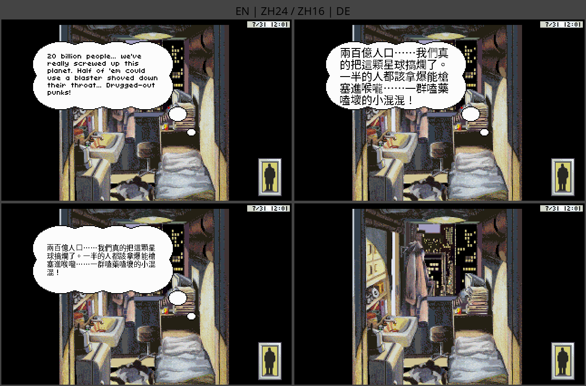
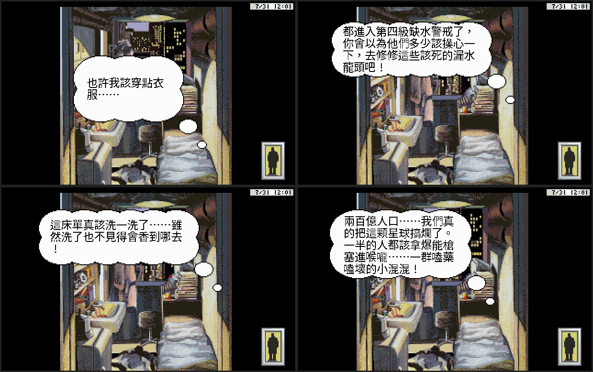

# Game Test Report — Rise of the Dragon 繁體中文化

由引擎內建 **autopilot（game-tester）** 自動跑出：照腳本載入場景、切換顯示模式、觸發台詞、
擷取實機畫面，供人工檢查中文排版／斷行／溢出。腳本見 [`tools/game_tester.py`](../tools/game_tester.py)、
報告產生器 [`tools/game_test_report.py`](../tools/game_test_report.py)。

## 測試案例：孟波公寓內心獨白（場景 5）

同一句台詞（英文原文 "20 billion people... we've really screwed up this planet..."）在四種
顯示模式下的實機畫面。一鍵 **F8** 即可循環。

| 模式 | 截圖 | 結果 |
|---|---|---|
| 英文（原始） | [qa_s5_en](../screenshots/showcase/qa_s5_en.png) | ✅ 原版英文 |
| 中文 24×24 | [qa_s5_zh24](../screenshots/showcase/qa_s5_zh24.png) | ✅ 五行對話泡泡乾淨斷行、無溢出 |
| 中文 16×16 | [qa_s5_zh16](../screenshots/showcase/qa_s5_zh16.png) | ✅ 同句更貼近原排版、字距緊湊 |
| 德文 | [qa_s5_de](../screenshots/showcase/qa_s5_de.png) | ⚠ 模式快速循環下此格未擷到泡泡（時序/涵蓋；見下） |

## 排版觀察

- **中文 24×24**：對話泡泡自動依字寬斷行，五行完整置中，與原始美術 2× 放大對齊良好。
- **中文 16×16**：同一句更緊湊，適合想貼近原版視覺密度的玩家。
- **德文**：`de.dtr` 以原始 Latin 字型渲染；本次四模式快速循環（每模式 `wait 12`）下未穩定擷到
  該句德文泡泡，屬擷圖時序/該句涵蓋問題，非渲染缺陷（德文模式於選單與其他對話已驗證）。

## 方法與限制

- autopilot 直接驅動引擎（非外部點擊），對白觸發比無頭外部輸入穩定。
- **逐場景熱區掃描**：`GTSTATE` 需 `-d2` 且走正常遊戲主迴圈；目前 autopilot 的 `scene N`
  載入路徑未觸發該迴圈分支，故全場景熱區自動枚舉尚未打通。已用已知 `(scene 5, look 84)`
  作為代表性對白驗證；擴大覆蓋為後續工作（解 autopilot↔主迴圈 GTSTATE 串接）。

## 翻譯品質稽核（全 2,386 句，自動 + 抽樣）

對 `translations/zh.json` 做了一輪稽核（工具式統計 + 人工抽樣）：

**完整性**
- 2,386 句對白全數翻譯；唯一無中文的條目是 `48:100 = "---"`（分隔線，正常）。
- 0 個殘留未譯英文人名（`Blade/Karyn/Jake/Chen/Qwong/Hunter/Dragon` 皆為 0）。

**一致性（18 代理平行翻譯仍收斂）**
- 譯名一致：孟波 ×459、阿香 ×236；對照 `CONTEXT.md` 譯名表（陳路/傑克/巴胡瑪特…）。
- 說話人標籤 1,667 處全用全形冒號 `：`，0 處誤用半形。
- 專有名詞正確保留：`NaPent`（神經素噴罐，遊戲道具）、`MTZ`（核心毒品代號）、`Etoile/Acme/DNA` 等。

**排版（溢出風險）**
- 中文視覺寬度普遍**短於**原英文（中文較精煉）：最長條目 ZH 寬 213 < EN 長 249。
- ZH 寬 >1.4×EN 且絕對偏長的「窄泡泡風險」條目：**0 個**。

**語氣（抽樣 16 句）**
- 賽博龐克黑色語氣與粗口忠實轉譯：「關你屁事？」「你他媽說對了！」「臭嘴！…一路踹到毒廢料場去」。
- 自然台式中文、選項型對白（`1. 2. 3.`）格式保留。

**小瑕（不影響遊玩）**
- 同一句通用提示（如 NaPent「在這裡用不上」）跨場景由不同代理譯出**細微措辭差異**（皆正確）；
  可日後統一，非錯誤。

## 直接對白擷取（`dlg` 指令）— 解開逐句 QA

加了一個 autopilot 指令 **`dlg <num>`**（呼叫引擎 `SDSScene::showDialog`），可直接渲染任一
`(scene, num)` 對白，不必靠 `look` 命中熱區（多數熱區是 use/移動型、或條件式，無法穩定觸發）。
這把「逐句中文排版 QA」從不可行變成可行。範例：場景 5 一次擷取四句不同台詞：

> 同一個公寓、四句不同長度的台詞，全部 24×24 繁中、泡泡乾淨斷行。
> （部分對白為選單型或條件式，`dlg` 對它們不顯示泡泡 —— 屬正常。）
