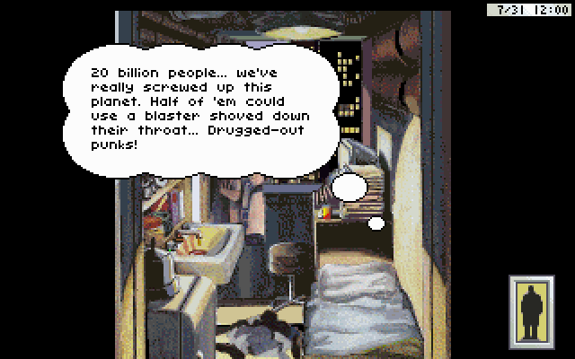
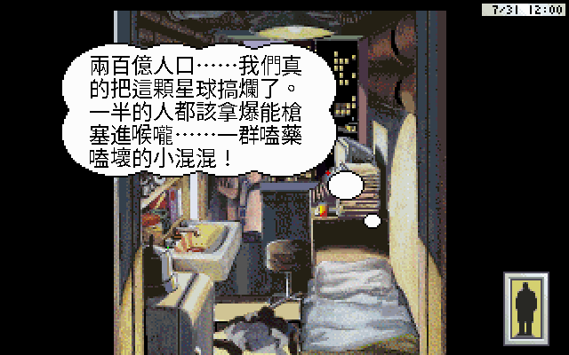
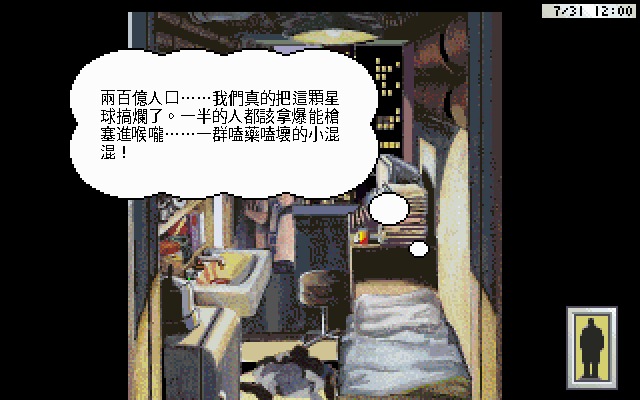
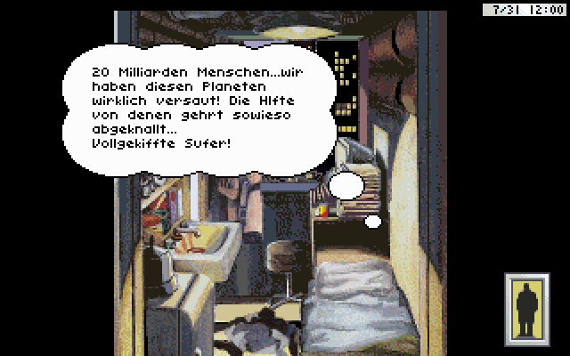

# Game Test Report — Rise of the Dragon 繁體中文化

由引擎內建 autopilot（game-tester）自動跑出。每格截圖是該場景某句台詞在某顯示模式下的實機畫面，供人工檢查中文排版/斷行/溢出。

## 摘要

- 測試場景：5
- 截圖數：4
- 顯示模式涵蓋：中文 16×16, 中文 24×24, 德文, 英文 (original)
- 找不到的熱區：無

## 逐項截圖

| # | 場景 | 動作 | 顯示模式 | 截圖 | 狀態 |
|---|---|---|---|---|---|
| 1 | 5 | `look 84` | 英文 (original) |  | ✅ |
| 2 | 5 | `(state)` | 中文 24×24 |  | ✅ |
| 3 | 5 | `(state)` | 中文 16×16 |  | ✅ |
| 4 | 5 | `(state)` | 德文 |  | ✅ |

> 截圖在完整 QA run 會產生於 `autopilot_shots/`（gitignored，本地重跑）；本報告示意用 `screenshots/showcase/` 的代表圖。
